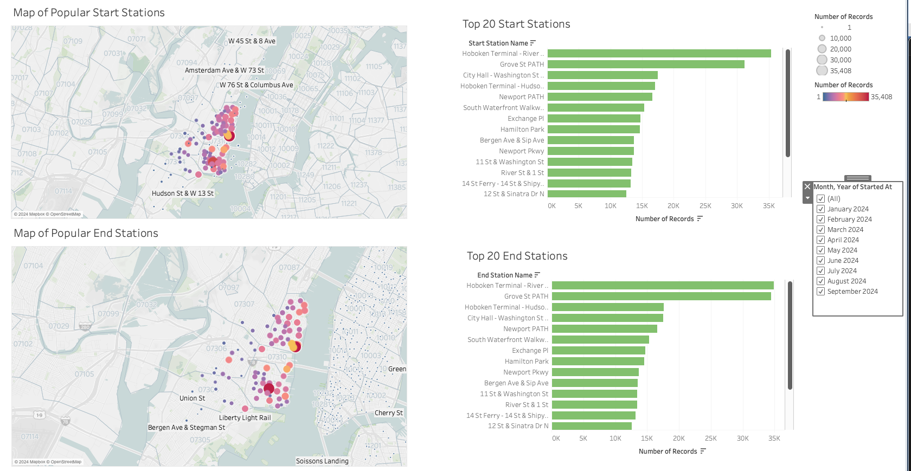
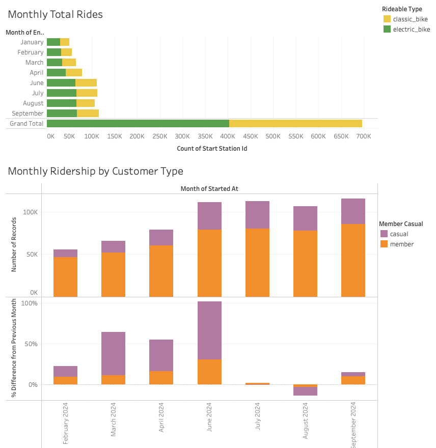

# Module 18 Challenge

## Link to Tableau Public

https://public.tableau.com/shared/8FF5H2G3F?:display_count=n&:origin=viz_share_link

#### Background

Congratulations on your new job! As the new lead analyst for the [New York Citi Bike**Links to an external site.**](https://en.wikipedia.org/wiki/Citi_Bike) program, you are now responsible for overseeing the largest bike-sharing program in the United States. In your new role, you will be expected to generate regular reports for city officials looking to publicize and improve the city program.

Since 2013, the Citi Bike program has implemented a robust infrastructure for collecting data on the program's utilization. Each month, bike data is collected, organized, and made public on the [Citi Bike Data**Links to an external site.**](https://www.citibikenyc.com/system-data) webpage.

However, while the data has been regularly updated, the team has yet to implement a dashboard or sophisticated reporting process. City officials have questions about the program, so your first task on the job is to build a set of data reports to provide the answers.

You will be selecting files to download from the [Citi Bike Data**Links to an external site.**](https://www.citibikenyc.com/system-data) source, as described in the following instructions.

#### Instructions

Your task in this assignment is to aggregate the data found in the Citi Bike Trip History Logs and find two unexpected phenomena.

1. Design 2–5 visualizations for each discovered phenomenon (4–10 total). You may work with a timespan of your choosing. Optionally, you can also merge multiple datasets from different periods.
   * The following are questions you may wish to answer. Do not limit yourself to these questions; they are suggestions for a starting point. Be creative!
     * How many trips have been recorded in total during the chosen period?
     * By what percentage has total ridership grown?
     * How have the proportions of short-term customers and annual subscribers changed?
     * What are the peak hours when bikes are used during the summer months?
     * What are the peak hours when bikes are used during the winter months?
     * Today, what are the top 10 stations in the city for starting a journey? Based on data, why do you hypothesize these are the top locations?
     * Today, what are the top 10 stations in the city for ending a journey? Based on data, why?
     * Today, what are the bottom 10 stations in the city for starting a journey? Based on data, why?
     * Today, what are the bottom 10 stations in the city for ending a journey? Based on data, why?
     * How does the average trip duration change by the type of user? (This may be under "User Type" or "member_casual" depending on the period the data is from).
     * What is the average distance in miles for a bike trip?
     * Which bikes (by ID) are most likely due for repair or inspection in the timespan?
     * How variable is the utilization by bike ID?
2. Use your visualizations (not necessarily all of them) to design a dashboard for each phenomenon. The dashboards should be accompanied by an analysis explaining why the phenomenon may be occurring.
3. Create one of the following visualizations for city officials:
   * **Basic:** A static map that plots all bike stations with a visual indication of the most popular locations to start and end a journey, with zip code data overlaid on top.
   * **Advanced:** A dynamic map that shows how each station's popularity changes over time (by month and year). Again, with zip code data overlaid on the map.
   * The map you choose should also be accompanied by a write-up describing any trends that were noticed during your analysis.
4. Create your final presentation:
   * Create a Tableau story that brings together the visualizations, requested maps, and dashboards.
   * Ensure your presentation is professional, logical, and visually appealing.

#### Considerations

Remember, the people reading your analysis will NOT be data analysts. Your audience will be city officials, public administrators, and heads of New York City municipal departments. Your data and analysis need to be presented in a way that is focused, concise, easy to understand, and visually compelling. Your visualizations should be colorful enough to be included in press releases, and your analysis should be thoughtful enough to inform programmatic changes.

#### Requirements

#### Map (25 points)

* Markers for all bike stations (5 points)
* Station markers indicate popularity by color, size, shape, or some other means (5 points)
* Ability to change marker data based on month and year (5 points)
* Sections are marked by zip code (5 points)
* A write-up on the trends that were discovered while making the map (5 points)

#### Visualizations (25 points)

* 4-10 total visualizations (5 points)
* A total of 2 Tableau dashboards, each dedicated to a specific data discovery (5 points)
* Dashboards are named appropriately (5 points)
* Data is cleaned such that data entry errors are removed and columns are correctly typed (5 points)
* Visualizations can logically be used to explore the data (5 points)

#### Tableau Story (25 points)

* Individual visualizations are used (5 points)
* Dashboards are used (5 points)
* A map is used (5 points)
* Visualizations on the same page are clearly related to one another (5 points)
* The story is informative and easy to navigate (5 points)

#### Analysis (25 points)

* Analysis is written in a markdown file or included in the Tableau Public workbook (5 points)
* Analysis describes the dashboards and any interesting data discoveries contained within them (5 points)
* Analysis on the chosen city official requested map detailing any noticeable trends (5 points)
* The written analysis references specific visualizations and interactive features (5 points)
* The document is written in a manner that a non-technical reader could understand (5 points)

# CitiBike Data Analysis

This project utilizes publicly available CitiBike data files to analyze usage trends in Jersey City for the year 2024.

## Data Source

The data was downloaded directly from the CitiBike website. A total of eight files (JC-202401 through JC-202409) were used, each representing a month from January through September 2024.  **Please note** : data for May (JC-202405) was not included as it was unavailable at the time of analysis.

## Data Preparation

For ease of analysis, all monthly files were combined into a single CSV file, `combined_citiBike_data.csv`. The code used to process and merge these files can be found in `Data_preparation.ipynb`.

The following calculated fields were created:

1. Trip Duration: DATEDIFF('minute', [Started At], [Ended At])
2. Number of Records to help with couting rows.
3. Trip Distance: longitude and latitude coordinates were converted to radians and the difference from end station to start station gave distance in km

## Map Dashboard

In the Map Dashboard shown above, you can view the most popular start and end stations, with all station names displayed. The marker size and color represent the number of rides originating from each station. The map also includes zip codes and boundaries to help pinpoint station locations. Additionally, horizontal bar charts highlight the top 20 start and end stations for easy reference. A filter tool is available to display data by month.

#### Key Findings:

1. Among the top 20 start and end stations, the top two are the same: Hoboken Terminal-Hudson St & Hudson Place and Grove St PATH. The other 18 stations remain consistent but vary in rank.
2. Several end stations are located in New York, indicating that some riders are using CitiBikes for commuting into New York City.

## Ride Type Breakdown Dashboard

The Ride Type Breakdown Dashboard shown above provides an in-depth look at monthly ridership patterns through two main visualizations:

1. **Monthly Rides** - A horizontal bar chart shows the number of rides per month and the type of bike.
2. **Member Type Breakdown** - A vertical stacked bar chart illustrates the distribution of rides by member type, with an added view of the monthly percentage change.

#### Key Findings:

1. **Total Ridership**: Up to September 2024, the total number of rides is 694,200.
2. **Seasonal Trend**: The Monthly Total Rides plot indicates that ridership increases with warmer weather, and electric bikes are generally preferred over classic bikes.
3. **Member Type Analysis**: The Monthly Ridership by Customer Type stacked bar chart shows that most rides are from members. Monthly percentage change remains relatively stable for members, while casual ridership shows larger fluctuations, including a 70% increase in June from the previous month.
4. **August Decline**: A notable 15% drop in ridership in August suggests further investigation into potential causes.
5. This dashboard provides a comprehensive view of ridership trends, helping to identify patterns and anomalies across different member types and seasons.

## CitiBike Story for 2024

A story was created with all of the key visuals. The header of the story outlines the key findings for that visual. Below are the findings for each slide.

1. Map of all CitiBike Start and End Stations in New Jersey. Top 20 stations are also shown.
2. 694,200 Total Rides to Date. Electric bikes are favored.
3. Members account for most of the rides taken.
4. Peak Ride Times: Summer Months and 4 PM to 7 PM
5. Longer rides are taken during the weekends in the summer months.
6. Average trip distance remains steady at 1.1–1.2 km, while trip duration increases during summer months.

## Recommendations for City Officials

* Prioritize the top 20 start and end stations when supplying and repairing bikes to ensure high-demand areas are well-serviced.
* Schedule bike repairs primarily during winter months to maximize bike availability during peak summer demand.
* Conduct a thorough investigation into the factors contributing to the decrease in both casual and member ridership observed in August.
* Give priority to electric bikes over classic bikes regarding inventory levels and maintenance, as they are more favored by riders.
